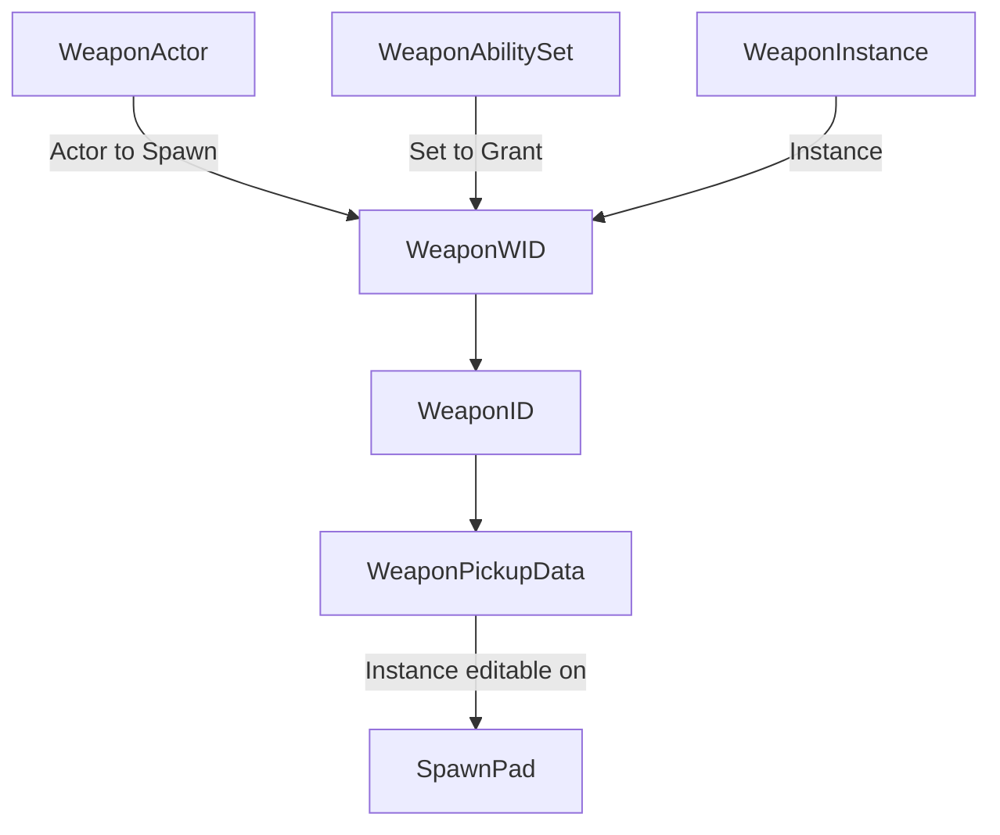

My main focus when reviewing Lyra was the Weapon systems and the pipeline that proceeded a player obtaining new weapon data upon pickup:



## Using the Ability Set within my project

I decided to replicate a part of the Weapon Pipeline into how my project approaches weapon pickups. I used some of the 'Lyra Ability Set' code, allowing me to assign various Gameplay Abilities, Effects and Attributes that could be added to the player's ASC upon pickup. This was also instrumental in picking an approach to assigning weapon default stats for later randomisation:

Initially I attempted to create a data table with enums for the row names, and stat names for columns. This would be useful for reading default stats upon pickup and I had planned to update the table with overwritten stats during the game. However, I had to abandon this after discovering that data tables are read-only at runtime.

I found the most time-efficient solution was to use the Granted Gameplay Effects within the Ability Set to apply default weapon stats. For this, I created several separate Effects for each weapon, that would override the player's current weapon stats to match the new weapon's default stats.

![[Default weapon stats BP.png]]

Then I used this Ability Set function to apply the default effect to the player's ASC:

```cpp wrap
//Gives the Abilities, Effects and Attributes to the Player's ASC (only showing granting Effects as others were not used)
void UGAAbilitySet::GiveToAbilitySystem(UAbilitySystemComponent* GAASC, FGAAbilitySet_GrantedHandles* OutGrantedHandles, UObject* SourceObject) const
{
	//Halts execution if ASC isn't valid
	check(GAASC);

	//Return if not running on host
	if (!GAASC->IsOwnerActorAuthoritative())
	{
		return;
	}
...
	//Grant effect for each in granted effects
	for (int32 EffectIndex = 0; EffectIndex < GrantedGameplayEffects.Num(); ++EffectIndex)
	{
		//Struct from array containing effect info
		const FGAAbilitySet_GameplayEffect& EffectToGrant = GrantedGameplayEffects[EffectIndex];

		//Check validity
		if (!IsValid(EffectToGrant.GameplayEffect))
		{
			continue;
		}
		
		//Effect retrieved from struct
		const UGameplayEffect* GameplayEffect = EffectToGrant.GameplayEffect->GetDefaultObject<UGameplayEffect>();
		
		//Create handle for newly applied effect
		const FActiveGameplayEffectHandle GameplayEffectHandle = GAASC->ApplyGameplayEffectToSelf(GameplayEffect, EffectToGrant.EffectLevel, GAASC->MakeEffectContext());
		
		//Add handle to OutGrantedHandles if it was passed in
		if (OutGrantedHandles)
		{
			OutGrantedHandles->AddGameplayEffectHandle(GameplayEffectHandle);
		}

	}
...
}
```

## Result

![[Weapon Pickup example better.mp4]]

From this example we can see the application of new weapon stats, upon pickup, via the updating ammo UI in the bottom right. If I were to improve I would like to figure out a way to collapse the several Effects into a singular Data Table.

[[A Minute to Win It Overview#Initial coding research|<Back to Project Overview]]