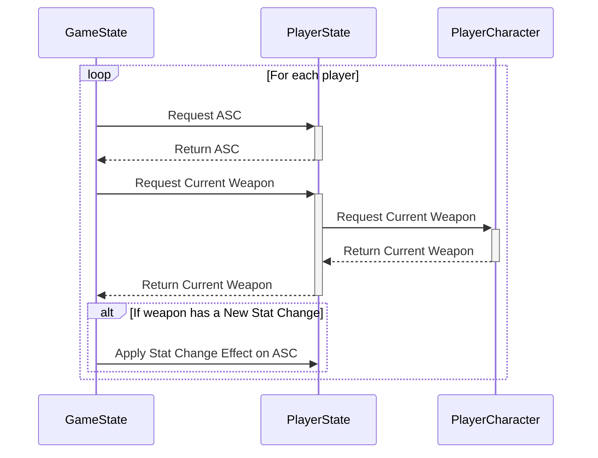

```cpp wrap
/*A Server only UFUNCTION, this function is also called when
picking up a weapon*/
void AGA_GameState::CheckCurrentWeapon_Implementation()
{
	//For each player
	for (int32 player = 0; player < PlayerArray.Num(); player++)
	{
		//Check for ASC
		AGA_CharacterStateBase* PS = Cast<AGA_CharacterStateBase>(PlayerArray[player]);
		UAbilitySystemComponent* ASC = PS->GetAbilitySystemComponent();
		if (!ASC)
		{
			continue;
		}
		//Check for Player Character
		AGAPlayerCharacter* PC = Cast<AGAPlayerCharacter>(PS->GetPawn());
		if (!PC)
		{
			continue;
		}
		//Confirm weapon has changes
		UGameplayEffect* EffectToApply = EffectMap.FindRef(PC->CurrentWeapon);
		if (EffectToApply)
		{
			//Validate modifiers
			if (EffectToApply->Modifiers.Num() <= 0)
			{
				continue;
			}
			ASC->ApplyGameplayEffectToSelf(EffectToApply, 1.0f, ASC->MakeEffectContext());
			continue;
		}
	}
}
```

This function is near identical to the one for resetting weapon stats, except it actually uses the Effect from the map, applying it to the appropriate player. If I were to improve I would probably collapse the two function into one to make the code more concise. Furthermore, this function is also called when a player picks up a weapon; this seems rather inefficient as it loops through every player, therefore I would try to find a fix that directly specifies which player is looking for changes.



[[Stat Randomisation Walkthrough#Applying weapon changes and UI updates|<Back to Stat Randomisation Walkthrough]]