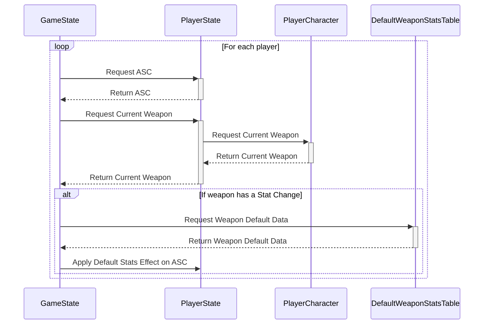

Within the Game State:
```cpp wrap
//Reset weapon stats on weapons
void AGA_GameState::ResetWeaponStats_Implementation()
{
	// For each player
	for (int32 player = 0; player < PlayerArray.Num(); player++)
	{
		//Check for ASC
		AGA_CharacterStateBase* PS = Cast<AGA_CharacterStateBase>(PlayerArray[player]);
		UAbilitySystemComponent* ASC = PS->GetAbilitySystemComponent();
		if (!ASC)
		{
			continue;
		}
		//Check for Player Character
		AGAPlayerCharacter* PC = Cast<AGAPlayerCharacter>(PS->GetPawn());
		if (!PC)
		{
			continue;
		}
		//Confirm weapon has change
		UGameplayEffect* EffectToApply = EffectMap.FindRef(PC->CurrentWeapon);
		if (EffectToApply)
		{
			//Find default stats in data table
			FDefaultWeaponStats* DefaultStatInfo = DefaultWeaponStatsTable->FindRow<FDefaultWeaponStats>(GetEnumValueAsName(TEXT("EWeaponTypes"), static_cast<int32>(PC->CurrentWeapon)), FString("FindingRow"));
			//Confirm default stats are valid
			if (!DefaultStatInfo)
			{
				continue;
			}
			//Clear UProperty used for reset effects
			ResetEffect = nullptr;
			//Instantiate with default values
			ResetEffect = NewObject<UGameplayEffect>(GetTransientPackage(), DefaultStatInfo->DefaultStatEffect);
			//Apply effect to player's ASC
			ASC->ApplyGameplayEffectToSelf(ResetEffect, 1.0f, ASC->MakeEffectContext());
			continue;
		}
	}
}
```

This function uses a Data Table containing default weapon stat effects, and applies them to the player if necessary.



[[Stat Randomisation Walkthrough#Reset values|<Back to Stat Randomisation Walkthrough]]