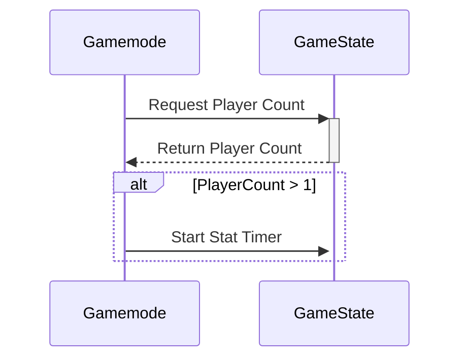

Here is a full rundown of the Stat Randomization Model with explanations:

## Initiating Stat Randomisation

Within the Game mode:
```cpp wrap
//On a successful login
void AGA_BaseGamemode::PostLogin(APlayerController* NewPlayer)
{
	//Call Parent function
	Super::PostLogin(NewPlayer);
	//Cast to Game State
	AGA_GameState* GS = Cast<AGA_GameState>(GameState);
	//Add new player to scores array
	PlayerScores.Add(0);
	int32 player_count = GetNumPlayers();
	//Check if the number of players is 2 or above
	if (GetNumPlayers() >= 2)
	{
		//If Game State is valid, start the Stat Timer and pass in options
		if (GS)
		{
			GS->StartStatTimer(WeaponsAffected, ChangesPerWeapon);
		}
	}
}
```

This code updates the player scores to account for a new player joining, and activates the Stat Timer if the number of players is above the required amount.

Within the Game State:

```cpp wrap
void AGA_GameState::StartStatTimer_Implementation(int32 NumOfWeapons, int32 ChangesPerWeapon)
{	
	//Create copies of our options for use outside of this function
	WeaponsAffectedCopy = NumOfWeapons;
	ChangesPerWeaponCopy = ChangesPerWeapon;
	//Initiate the first stat randomisation
	RandomiseStats();
	//Setup a looping timer for future randomisation
	GetWorldTimerManager().SetTimer(StatTimerHandle, this, &AGA_GameState::RandomiseStats, 60.0f, true);
}
```

Above we create copies of our game settings and commence randomisation, whilst activating the associated timer. This function is a Server only UFUNCTION, hence the "Implementation" suffix.




## Reset values

All code specified from here on is contained within the Game State:

```cpp wrap
//Create random stat effects
void AGA_GameState::RandomiseStats_Implementation()
{
	//Reset previously changed stats on weapons with effectmap before it's cleared
	ResetWeaponStats();
	//Empty effect map
	EffectMap.Empty();
	//Empty UI struct array
	WeaponChangeArray.Empty();
```

Here, we cleanup the variables required for the Stat Randomisation, such as [[Resetting Weapon Stats]] so that weapons are cleared of changes before new ones are generated. I opted to use a 'TMap' to match weapons and their effects, since I ran into multiple issues using two separate arrays in tandem.

## Filter out unnecessary attributes

```cpp wrap
	//Use array for getting random attribute
	TArray<FGameplayAttribute> WeaponAttributesArray;
	//Fill our array with weapon attributes
	Cast<UAttributeSet>(WeaponSet->GetDefaultObject())->GetAttributesFromSetClass(WeaponSet, WeaponAttributesArray);
	//Create a seperate array to be filled with filtered attributes
	TArray<FGameplayAttribute> FilteredAttributesArray;
	//Filter out 'current' attributes e.g. current ammo and current clip ammo
	for (FGameplayAttribute AttributeToCheck : WeaponAttributesArray)
	{
		FString AttributeToCheckName = AttributeToCheck.GetName();
		//If name contains "Ammo"
		if (AttributeToCheckName.Find(FString("Ammo")) >= 0)
		{
			//If not a "Max" value
			if (!(AttributeToCheckName.StartsWith(FString("Max"))))
			{
				continue;
			}
		}
		//Add to filtered
		FilteredAttributesArray.Add(AttributeToCheck);
	}
```

This code filters out any 'current' ammo values from the attributes to be randomised, as this would interfere with reloading subsystems. If I were to improve this, I would separate the weapon attributes that can be changed, from those that cannot, to avoid this workaround.

## Align with Game Options

```cpp wrap
	//Ensures our changes never exceed the num of attributes available
	ChangesPerWeaponCopy = FMath::Clamp(ChangesPerWeaponCopy, 1, FilteredAttributesArray.Num());
	//Ensures the weapons affected never exceeds the num of weapons available
	WeaponsAffectedCopy = FMath::Clamp(WeaponsAffectedCopy, 1, StaticEnum<EWeaponTypes>()->NumEnums());
	//An array of available weapons (to be adjusted upon iterations)
	TArray<EWeaponTypes> AvailableWeapons;
	//Populate with all values from weapon enum
	for (int32 weapontype = 1; weapontype < (StaticEnum<EWeaponTypes>()->NumEnums() - 2); weapontype++)
	{
		EWeaponTypes AvailableWeapon = StaticCast<EWeaponTypes>(weapontype);
		AvailableWeapons.Add(AvailableWeapon);
	}
```

Above, we configure the copies of the game settings values to ensure they are within the bounds of our parameters, and then create an array of "Available Weapons" to be shortened when weapons are assigned an effect.

## Main Randomisation

```cpp wrap
	//For each weapon to have stat changes
	for (int32 Weapon = 0; Weapon < WeaponsAffectedCopy; Weapon++)
	{
		//Continue if all weapons have been assigned effects
		if (AvailableWeapons.Num() < 1)
		{
			continue;
		}
		//Random index
		int32 RandomWeaponIndex = FMath::RandRange(0, AvailableWeapons.Num() - 1);
		//Get enum type from index
		EWeaponTypes RandomWeapon = AvailableWeapons[RandomWeaponIndex];
		//Remove from the available pool
		AvailableWeapons.RemoveAt(RandomWeaponIndex);
		//Creates our instantiated default gameplay effect
		CreateEffect(RandomWeapon);
```

In this code we begin the loop through the "WeaponsAffected" array, initially checking that there are weapons available to choose from. Then we generate a random weapon and remove it from the pool, while [[Creating Weapon Stat Effects|creating an instantiated Gameplay Effect]] for it.

```cpp wrap
		//Array for random attributes
		TArray<FGameplayAttribute> RandomAttributes;
		//Make a copy so we can remove values from it once generated
		TArray<FGameplayAttribute> FilteredAttributesArrayCopy = FilteredAttributesArray;
		//Generate our random attributes
		for (int32 Stat = 0; Stat < ChangesPerWeaponCopy; Stat++)
		{
			//Continue if no attributes left to change
			if (FilteredAttributesArrayCopy.Num() < 0)
			{
				continue;
			}
			//Define a random attribute
			FGameplayAttribute AttributeToAdd = FilteredAttributesArrayCopy[FMath::RandRange(0, FilteredAttributesArrayCopy.Num() - 1)];
			//Populate array with random attribute
			RandomAttributes.Add(AttributeToAdd);
			//Remove from copy array to prevent duplicates
			FilteredAttributesArrayCopy.Remove(AttributeToAdd);
		}
```

Then we create an array for our randomly generated attributes, as well as a copy of the "FilteredAttributesArray" so we can remove values from it within this iteration. Following this we generate the random attributes, adding them to the empty array and removing them from our copied attribute pool array.

```cpp wrap
		//Set our amount of modifiers from how many changes per weapon
		EffectMap[RandomWeapon]->Modifiers.SetNum(ChangesPerWeaponCopy);
		//Local struct for UI changes display
		FWeaponChangeData WeaponChange;
		//Set random weapon for UI changes display
		WeaponChange.Weapon = RandomWeapon;
```

Then we set our number of effect modifiers to align with the "ChangesPerWeaponCopy", and we also create a local struct for reflecting the changes in the UI.

```cpp wrap
		//For each random attribute
		for (int32 AttributeIndex = 0; AttributeIndex < RandomAttributes.Num(); AttributeIndex++)
		{
			//Get modifier info
			FGameplayModifierInfo& Stat = EffectMap[RandomWeapon]->Modifiers[AttributeIndex];
			//Set modifier type (multiplicitive as we use percentages)
			Stat.ModifierOp = EGameplayModOp::Multiplicitive;
			//Assign attribute to be manipulated
			Stat.Attribute = RandomAttributes[AttributeIndex];
			//Using a float to be multiplied against the original value
			float RandomChangeMagnitude;
			//Ensures theres at least 1 of each type (positive/negative)
			if ((Weapon + 1) <= (WeaponsAffectedCopy / 2))
			{
				//Modifier magnitude (Percentage increase)
				RandomChangeMagnitude = FMath::RandRange(110, 175);
			}
			else
			{
				//Modifier magnitude (Percentage decrease)
				RandomChangeMagnitude = FMath::RandRange(25, 90);
			}
			//Convert percentage to decimal number for multiplication
			RandomChangeMagnitude = RandomChangeMagnitude / 100;
			//Set as our modifier magnitude
			Stat.ModifierMagnitude = FScalableFloat(RandomChangeMagnitude);
			//Build the rest of our UI struct
WeaponChange.AttributeToChange.Add(RandomAttributes[AttributeIndex].AttributeName);
			WeaponChange.ChangeMagnitude.Add(RandomChangeMagnitude);
		}
		//Add our simplified changes struct to an array to be sent to UI
		WeaponChangeArray.Add(WeaponChange);
	}
```

Above, we are looping through the random attributes generated and setting up the Effect modifiers. This also involves creating at least one positive and negative stat change for each weapon, which are randomly generate between fixed ranges. Afterwards, we finish adding the necessary data to our UI struct and add it to an array to be sent off to the UI after looping through all the weapons.

## Applying weapon changes and UI updates

```cpp wrap
	//Check and apply weapon changes to players
	CheckCurrentWeapon();
	//Call this so it'll run on the hosting player too
	OnRep_WeaponChangeArray();
	}
```

Finally, after completing the loop for each weapon, we [[Applying Weapon Changes|apply weapon changes]] and [[Communicating Stat Changes UI|communicate UI updates]].

## Result

![[Stat Randomisation example.mp4]]

This, albeit messy, example demonstrates the Stat Randomisation in real-time. UI pop-ups reveal information about the changes and we can see the max-ammo of the, currently equipped, Assault Rifle increase in the bottom right.

[[A Minute to Win It Overview#Development process|<Back to Project Overview]]