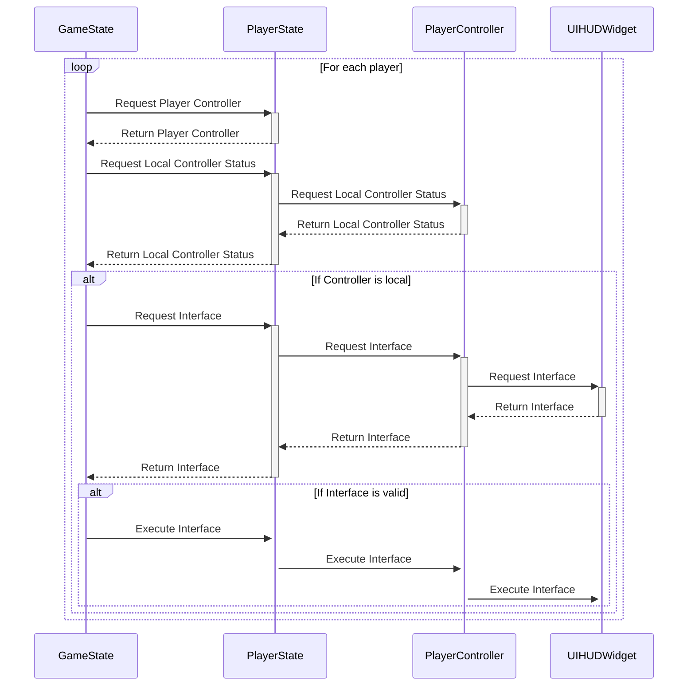

```cpp wrap
void AGA_GameState::OnRep_WeaponChangeArray()
{
	//For each player, communicate UI changes
	for (int32 p = 0; p < PlayerArray.Num(); p++)
	{
		//Get Player State
		AGA_PlayerState* PS = Cast<AGA_PlayerState>(PlayerArray[p]);
		//Validate Player Controller
		AGA_CharacterControllerBase* PlayerController = Cast<AGA_CharacterControllerBase>(PS->GetPlayerController());
		if (!PlayerController)
		{
			continue;
		}
		//If controller is not local(not the player on that machine)
		if (!PlayerController->IsLocalController())
		{
			continue;
		}
		//Check if interface is implemented
		if (!(PlayerController->UIHUDWidget)->Implements<UWeaponChangeInterface>())
		{
			continue;
		}
		//Execute Blueprint Native Event on Interface with the struct array
		IWeaponChangeInterface::Execute_OnAttributeChange(PlayerController->UIHUDWidget, WeaponChangeArray);
	}
}
```

The function above is also similar to the two handling resetting and applying weapon changes, however it checks for a Player Controller instead, and is actually an "OnRep" function that is called whenever it's associated UPROPERTY changes, on every machine. Within the loop, the status of the Controller as Local is checked, and an interface function is called on the Controller's "UIHUDWidget". This means that the function will only run for the machine running the replicated function. To improve I would try to find an alternative to running a loop on every machine.



[[Stat Randomisation Walkthrough#Applying weapon changes and UI updates|<Back to Stat Randomisation Walkthrough]]